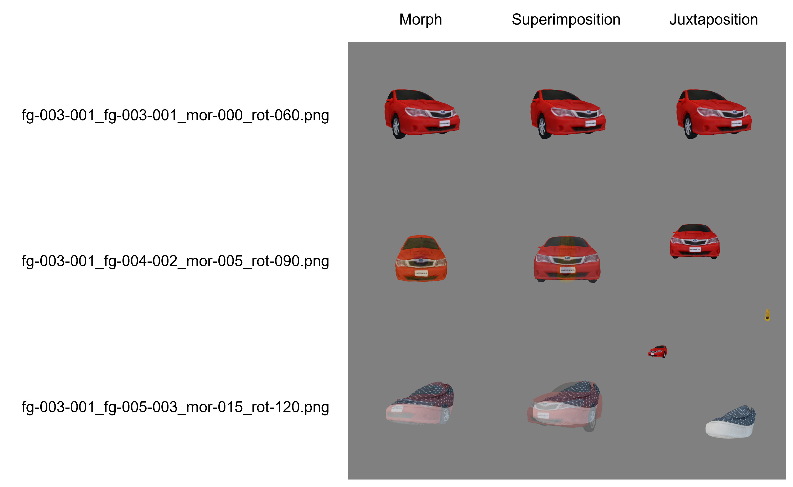

# Signatures of the uncanny valley effect in an artificial neural network

> Robots and computer graphics characters that resemble humans but are not perfectly human-like tend to evoke negative feelings in human observers, which is known as the "uncanny valley effect." In this study, we used a recent artificial neural network called Contrastive Language-Image Pre-training (CLIP) that learns visual concepts from natural language supervision as a visual sentiment model for humans to examine the semantic match between images with graded manipulation of human-likeness and words used in previous studies to describe the uncanny valley effect. Our results showed that CLIP estimated the matching of words of negative valence to be maximal at the midpoint of the transition from a human face to other objects, thereby indicating the signature of the uncanny valley effect. Our findings suggest that visual features characteristic to the conflicts of visual cues, particularly cues related to human faces, are associated with negative verbal expressions in our everyday experiences, and CLIP learned such an association from the training datasets. Our study is a step toward exploring how visual cues are related to human observers' sentiment using a novel psychological platform, that is, an artificial neural network.

<a href="https://doi.org/10.1016/j.chb.2023.107811"></a>


This repository was made for data sharing.
It contains: 
1) Code to calculate CLIP embeddings for an input word using [CLIP](https://github.com/openai/CLIP).
2) A dataset of the normalized CLIP embeddings of our image stimuli calculated using <a href="zero-shot_prediction_batch.py">zero-shot_prediction_batch.py</a>.
3) Code to calculate the cosine similarity between word embeddings and image embeddings.

## Blending methods

Switch blending methods by selecting a path.

e.g. If you want to chose "Morph" images, then load data from output/morph/clip_embedding_normalized.pt

<!--  -->
<div align="center">
    
</div>

<!-- 
## Output of  demo code
```bash
(clip) $ python zero-shot_prediction_batch.py 
loading images from img/morph/*.png...
4100/4130
calculating embeddings...
saving...
loading images from img/superimposition/*.png...
4100/4130
calculating embeddings...
saving...
loading images from img/juxtaposition/*.png...
4100/4130
calculating embeddings...
saving...
(clip) $ 
```
 -->

## How to use our data and codes

### Loading a dataset of the normalized CLIP embeddings of our image stimuli

```python
>>> import torch
>>> feats = torch.load("output/morph/clip_embedding_normalized.pt")
>>> feats.keys()
dict_keys(['fg-001-001_fg-001-001_mor-000_rot-000.png', 'fg-001-001_fg-001-001_mor-000_rot-030.png', 'fg-001-001_fg-001-001_mor-000_rot-060.png', ... ])
>>> feats['fg-001-001_fg-001-001_mor-000_rot-000.png'].shape
torch.Size([1, 512])
```

### Calculating cosine similarity between the CLIP embedding of a specified word and the normalized CLIP embedding of a specified image

```bash
(clip) $ python calculate_cosine_similarity.py \
            --path_feat="output/morph/clip_embedding_normalized.pt" \
            --name_img="fg-001-001_fg-001-001_mor-000_rot-090.png" --c="living"
tensor([[0.2350]], device='cuda:0', dtype=torch.float16)
```


## Naming rules of images

### Category ID

|Key|Object category|
|-|-|
|fg-001|Human|
|fg-002|Macaque monkey|
|fg-003|Car|
|fg-004|Fruit and vegetable|
|fg-005|Shoe|

"-***" after Category ID indicates id number of exemplars.

### Blending level ID

|Key|Blending operation|
|-|-|
|mor-000|No manipulation|
|mor-005|Blending 75% of the first image with 25% of the second image|
|mor-010|Blending 50% of the first image with 50% of the second image|
|mor-015|Blending 25% of the first image with 75% of the second image|

### View orientation ID 

|Key|View orientation|
|-|-|
|rot-060|30 degrees right from the front|
|rot-090|The front view|
|rot-120|30 degrees left from the front|


## Acknowledgments
CLIP embeddings were calculated using [CLIP](https://github.com/openai/CLIP) developed by OpenAI.

## Citation
If you use the embeddings shared in this repository for your research, please cite the following works:
```
@article{igaue2023signatures,
  title={Signatures of the uncanny valley effect in an artificial neural network},
  author={Igaue, Takuya and Hayashi, Ryusuke},
  journal={Computers in Human Behavior},
  volume={146},
  pages={107811},
  year={2023},
  publisher={Elsevier}
}
```
